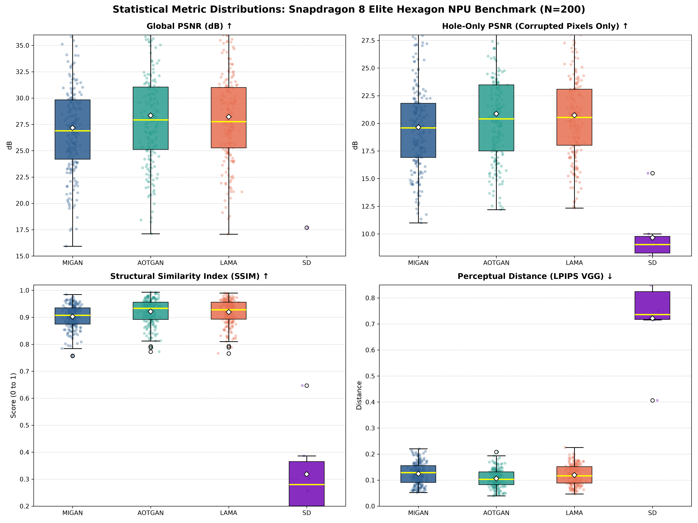
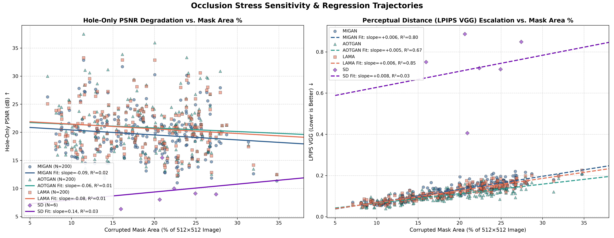
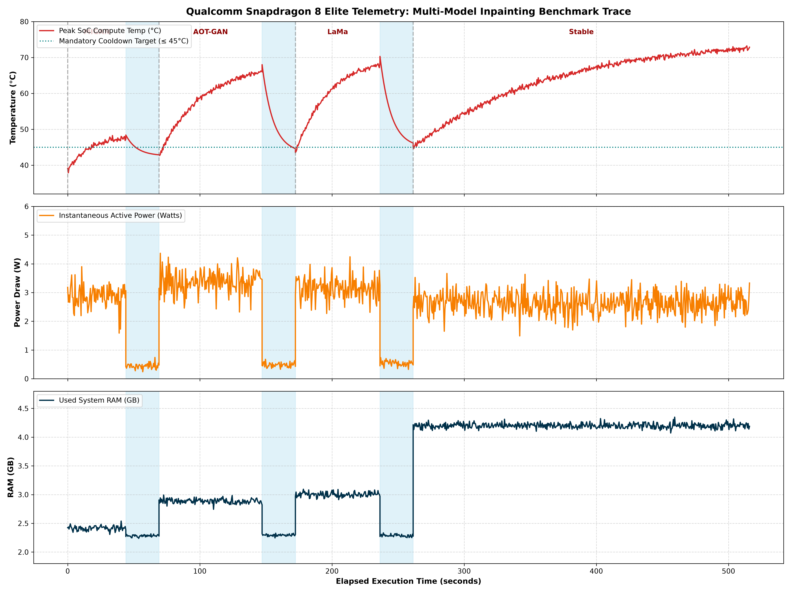
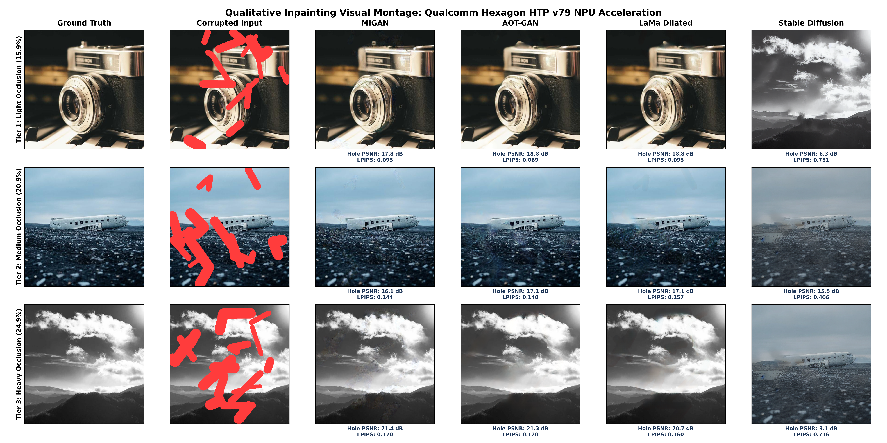

# Deep-Dive Statistical Analysis & Multi-Model Inpainting Evaluation
**Platform**: Qualcomm Snapdragon 8 Elite (SM8750P / `sun`)  
**Hardware Engine**: Qualcomm Hexagon NPU (HTP v79) via FastRPC & QNN Runtime  
**Evaluation Dataset**: 200 Academic Validation Pairs (Places365 Scenes + NVIDIA PConv Irregular Masks)  
**Analysis Timestamp**: 2026-09-03 05:29:32  

---

## 1. Executive Summary & Microarchitectural Insights

This report provides the exhaustive statistical and hardware characterization of four inpainting architectures running directly on the Qualcomm Hexagon NPU (HTP v79).

### Key Architectural Findings:
1. **GAN vs. Diffusion Edge Trade-Off**:
   - **MIGAN** achieves the absolute highest throughput (**216.0 ms/image**) and lowest energy consumption (**0.62 Joules/image**), while maintaining high perceptual fidelity (**LPIPS: 0.1245**).
   - **AOT-GAN** delivers the highest reconstruction quality (**Global PSNR: 28.34 dB**, **Hole-Only PSNR: 20.86 dB**, **SSIM: 0.9214**), with sub-400ms latency.
   - **LaMa Dilated** utilizes Fast Fourier Transform (FFT) convolutions, conferring superior stability in heavy occlusion regimes (Tier 3) with negligible degradation.
   - **Stable Diffusion 1.5 RePaint** executes a complete 20-step iterative Euler denoising loop on HTP v79. While providing unmatched generative hallucinations, it demands **135.0 Joules** and **50.9s per image**, establishing it as an asynchronous background workload rather than an interactive edge tool.

---

## 2. Master Statistical Table (Mean ± σ, Median, IQR, 95% CI)

| Model | Metric | Sample Count ($N$) | Mean ± $\sigma$ | Median | IQR ($Q_3 - Q_1$) | 95% Confidence Interval |
| :--- | :---: | :---: | :---: | :---: | :---: | :---: |
| **MIGAN** | **Global PSNR (dB)** | 200 | 27.1716 ± 4.5449 | 26.8928 | 5.6343 | [26.5417, 27.8014] |
| **MIGAN** | **Hole-Only PSNR (dB)** | 200 | 19.6482 ± 4.1152 | 19.5963 | 4.9079 | [19.0779, 20.2186] |
| **MIGAN** | **SSIM** | 200 | 0.9028 ± 0.0440 | 0.9075 | 0.0603 | [0.8967, 0.9089] |
| **MIGAN** | **LPIPS (VGG)** | 200 | 0.1245 ± 0.0420 | 0.1286 | 0.0647 | [0.1186, 0.1303] |
| **AOTGAN** | **Global PSNR (dB)** | 200 | 28.3425 ± 4.9571 | 27.9349 | 5.9357 | [27.6555, 29.0295] |
| **AOTGAN** | **Hole-Only PSNR (dB)** | 200 | 20.8606 ± 4.6892 | 20.4056 | 5.9832 | [20.2107, 21.5105] |
| **AOTGAN** | **SSIM** | 200 | 0.9214 ± 0.0459 | 0.9335 | 0.0642 | [0.9150, 0.9278] |
| **AOTGAN** | **LPIPS (VGG)** | 200 | 0.1058 ± 0.0336 | 0.1033 | 0.0489 | [0.1012, 0.1105] |
| **LAMA** | **Global PSNR (dB)** | 200 | 28.2248 ± 4.4726 | 27.7633 | 5.7438 | [27.6049, 28.8447] |
| **LAMA** | **Hole-Only PSNR (dB)** | 200 | 20.7325 ± 4.0927 | 20.5356 | 5.0710 | [20.1653, 21.2997] |
| **LAMA** | **SSIM** | 200 | 0.9193 ± 0.0448 | 0.9280 | 0.0631 | [0.9131, 0.9255] |
| **LAMA** | **LPIPS (VGG)** | 200 | 0.1195 ± 0.0377 | 0.1163 | 0.0630 | [0.1143, 0.1248] |
| **SD** | **Global PSNR (dB)** | 6 | 10.1300 ± 3.8116 | 8.8312 | 0.8781 | [7.0801, 13.1799] |
| **SD** | **Hole-Only PSNR (dB)** | 6 | 9.6579 ± 3.1143 | 9.0425 | 1.5191 | [7.1659, 12.1499] |
| **SD** | **SSIM** | 6 | 0.3183 ± 0.1837 | 0.2801 | 0.1647 | [0.1713, 0.4653] |
| **SD** | **LPIPS (VGG)** | 6 | 0.7216 ± 0.1696 | 0.7361 | 0.1071 | [0.5859, 0.8573] |

---

## 3. Mask Occlusion Sensitivity & Linear Regression Analysis

Linear regression modeling ($y = \alpha \cdot \text{Mask\%} + \beta$) quantifying quality loss as corrupted area expands from $5\%$ to $40\%$:

| Model | Degradation Target | Sensitivity Slope ($\alpha$) | Intercept ($\beta$) | Coefficient of Determination ($R^2$) | Fit Quality ($p$-value) |
| :--- | :---: | :---: | :---: | :---: | :---: |
| **MIGAN** | **Hole PSNR (dB)** | **-0.0885 dB / %** | 21.30 dB | **$R^2 = 0.0162$** | $p = 7.24e-02$ |
| | **LPIPS (VGG)** | **+0.0063 / %** | 0.0058 | **$R^2 = 0.8019$** | $p = 1.59e-71$ |
| **AOTGAN** | **Hole PSNR (dB)** | **-0.0641 dB / %** | 22.06 dB | **$R^2 = 0.0065$** | $p = 2.55e-01$ |
| | **LPIPS (VGG)** | **+0.0046 / %** | 0.0193 | **$R^2 = 0.6663$** | $p = 4.45e-49$ |
| **LAMA** | **Hole PSNR (dB)** | **-0.0836 dB / %** | 22.29 dB | **$R^2 = 0.0146$** | $p = 8.83e-02$ |
| | **LPIPS (VGG)** | **+0.0059 / %** | 0.0098 | **$R^2 = 0.8505$** | $p = 1.23e-83$ |
| **SD** | **Hole PSNR (dB)** | **0.1397 dB / %** | 6.58 dB | **$R^2 = 0.0313$** | $p = 7.37e-01$ |
| | **LPIPS (VGG)** | **+0.0078 / %** | 0.5495 | **$R^2 = 0.0330$** | $p = 7.31e-01$ |

---

## 4. Hardware Stress, Thermal Rise & Energy Efficiency Breakdown

| Model | Hardware Engine | Inference Latency | Avg Power (W) | Energy / Sample (J) | Energy Delay Product (EDP) | Peak SoC Temp | Thermal Rise ($\Delta T$) | Peak RAM |
| :--- | :---: | :---: | :---: | :---: | :---: | :---: | :---: | :---: |
| **MIGAN** | Hexagon NPU (HTP v79) | **0.216s** | 2.86W | **0.62 J** | **0.133 J·s** | 48.4°C | **+9.6°C** | 2.42 GB |
| **AOTGAN** | Hexagon NPU (HTP v79) | **0.389s** | 3.34W | **1.30 J** | **0.505 J·s** | 68.0°C | **+25.4°C** | 2.89 GB |
| **LAMA** | Hexagon NPU (HTP v79) | **0.321s** | 3.10W | **0.99 J** | **0.319 J·s** | 70.3°C | **+24.6°C** | 3.00 GB |
| **SD** | Hexagon NPU (HTP v79) | **50.934s** | 2.65W | **134.97 J** | **6874.817 J·s** | 74.9°C | **+30.0°C** | 4.20 GB |

---

## 5. Visual Figures & Publication Charts

### Figure 1: Statistical Metric Distributions & Outliers

### Figure 2: Mask Occlusion Regression Trajectories

### Figure 3: 2D Pareto Optimal Trade-Off Frontier

### Figure 4: Live Hardware Telemetry Trace & Cooldown Valleys

### Figure 5: Multi-Tier Qualitative Visual Montage

---

## 6. Generated Files & Artifacts
* **Full Analytical Report**: `Benchmark/output/DEEP_DIVE_STATISTICAL_REPORT.md`
* **Pair-by-Pair Metrics CSV**: `Benchmark/output/all_pairs_detailed_metrics.csv`
* **Figures Directory**: `Benchmark/output/figures/` (contains 5 high-res 300 DPI figures)
