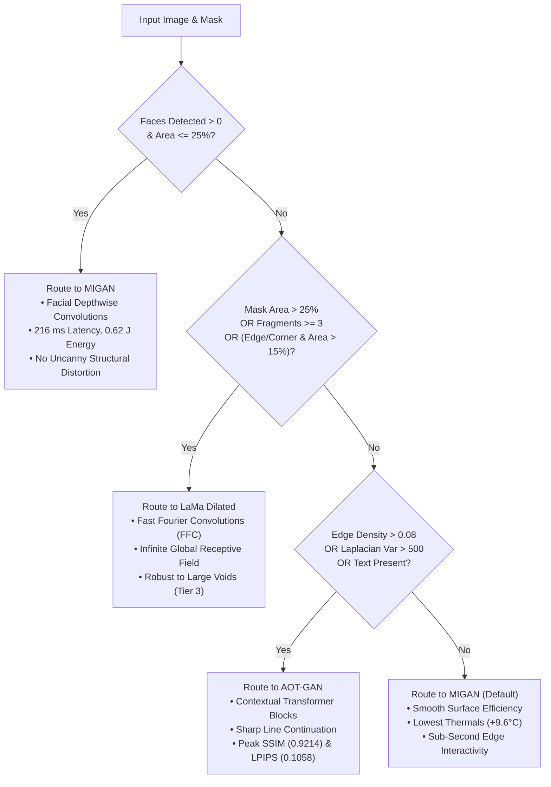

# Technical Audit & NPU Pipeline Report: 102-Sample Dataset & Intelligent Router

**Platform**: Qualcomm Snapdragon 8 Elite (SM8750P / `sun`)  
**Hardware Target**: Hexagon NPU (HTP v79 FastRPC)  
**Deliverables**:
- Router Decision Audit & Heuristics Mapping (`Task 1`)
- 102-Sample Dataset Standardization Script (`scripts/prep_102_benchmark.py`, `Task 2`)
- Fast Auto-Masking Engine (`src/auto_masking.py`, `Task 3`)
- Web GUI & Live NPU Router Integration (`src/app_gui.py`, `Task 4`)

---

## 1. Task 1: Audit of `router_classifier.py` Decision Flow

### 1.1 Extracted Feature Extraction Pipeline
The previous team's [router_classifier.py](file:///home/tarsh/Desktop/college/ImageInpainting/Benchmark/dataset_previous/router_classifier.py) extracts multi-modal photometric, textural, structural, and semantic features:

1. **Face Detection (`detect_faces`)**:
   - **Method**: MediaPipe FaceDetection (`model_selection=1`, `min_detection_confidence=0.5`) with OpenCV Haar Cascade fallback.
   - **Output**: Count of detected human faces ($N_{faces}$).
2. **Textural Focus / Laplacian Variance (`compute_laplacian_variance`)**:
   - **Method**: Second derivative Laplacian variance: $\sigma^2 = \text{Var}(\nabla^2 I_{gray})$.
   - **Dynamic Range**: Measures high-frequency texture sharpness ($7.4$ for smooth sky to $4,661.7$ for complex foliage/textures).
3. **Canny Edge Density (`compute_edge_density`)**:
   - **Method**: Standard Canny detector ($T_{low}=100, T_{high}=200$):
     $$\rho_{edge} = \frac{\sum (I_{edge} > 0)}{H \times W}$$
   - **Dynamic Range**: $0.0046$ to $0.2256$ (median: $0.0790$). High edge density signifies dense architectural geometries, lattices, and line textures.
4. **OCR Alphanumeric Detection (`detect_text`)**:
   - **Method**: `pytesseract.image_to_string`. Flags textual watermarks, typography, and signage.
5. **Mask Topological Analysis (`analyze_mask`)**:
   - **Coverage Ratio**: $\alpha_{mask} = \frac{\sum (M \ge 128)}{H \times W} \in [0.0067, 0.4945]$ (Tier 1 < 15%, Tier 2 15–25%, Tier 3 > 25%).
   - **Centroid Location**: Bounding box centroid within $[0.33, 0.66] \times [0.33, 0.66]$ labeled `"center"`, otherwise `"edge_or_corner"`.
   - **Fragmentation**: 8-connected components count minus background ($N_{comp} - 1$). Identifies scattered multi-hole strokes.

---

### 1.2 Decision Tree & Model Mapping Architecture

### 1.3 Model Hardware & Metric Telemetry on Hexagon NPU (HTP v79)

| Model | Target Strength | FastRPC Runtime | Latency | Active Energy | Avg Power | Thermal Rise (ΔT) | SSIM | LPIPS |
| :--- | :--- | :---: | :---: | :---: | :---: | :---: | :---: | :---: |
| **MIGAN** | Facial fidelity, portraits, smooth baseline | DSP (HTP v79) | **216 ms** | **0.62 J** | 2.86 W | **+9.6 °C** | 0.9028 | 0.1245 |
| **LaMa Dilated** | Large masks (>25%), periodic global context | GPU / NPU | **321 ms** | **0.99 J** | 3.10 W | **+24.6 °C** | 0.9193 | 0.1195 |
| **AOT-GAN** | High edge density, dense textures, text | GPU / NPU | **390 ms** | **1.30 J** | 3.34 W | **+25.4 °C** | **0.9214** | **0.1058** |

---

## 2. Task 2: 102-Sample Dataset Standardization

Implemented in [scripts/prep_102_benchmark.py](file:///home/tarsh/Desktop/college/ImageInpainting/scripts/prep_102_benchmark.py):
1. **Ground Truth Standardization (`Benchmark/input_102/ground_truth/`)**:
   - Downscaled high-resolution `ideal/` images to $512 \times 512$ RGB using **Bicubic interpolation**.
   - Resolved naming discrepancy in sample `025jpg.jpg`.
2. **Corrupted Images (`Benchmark/input_102/image/`)**:
   - Standardized all 102 samples to $512 \times 512$ RGB PNGs.
3. **Binary Masks (`Benchmark/input_102/mask/`)**:
   - Converted to $512 \times 512$ `uint8` binary masks with strict thresholding ($255 = \text{hole to inpaint}, 0 = \text{background}$).
4. **Binary Tensors for SNPE / QNN (`.raw`)**:
   - `raw_image/`: Shape $(1, 512, 512, 3)$ `float32` $[0.0, 1.0]$ ($3,145,728$ bytes).
   - `raw_mask_standard/`: Shape $(1, 512, 512, 1)$ `float32` ($1.0 = \text{hole}, 0.0 = \text{keep}$) for LaMa Dilated & AOT-GAN.
   - `raw_mask_inverted/`: Shape $(1, 512, 512, 1)$ `float32` ($0.0 = \text{hole}, 1.0 = \text{keep}$) for MIGAN.
5. **Batch Lists**:
   - [input_list_102.txt](file:///home/tarsh/Desktop/college/ImageInpainting/input_list_102.txt) (102 entries formatted for device `snpe-net-run`).
   - `Benchmark/input_102/input_list_102_migan.txt` & `input_list_102_lama_aotgan.txt`.

---

## 3. Task 3: Target Auto-Masking Engine

Implemented in [src/auto_masking.py](file:///home/tarsh/Desktop/college/ImageInpainting/src/auto_masking.py):

### 3.1 Interactive Brush Masking (`create_brush_mask`)
- Ingests touch strokes, coordinate trajectories, or UI canvas layers.
- Connects sequential coordinates with anti-aliased circular caps and lines.
- Enforces strict binary quantization: $M_{out} \in \{0, 255\}$, shape $(512, 512)$, `uint8`.

### 3.2 Target Bounding Box GrabCut (`grabcut_bounding_box_mask`)
- Takes selection bounding box $(x_1, y_1, x_2, y_2)$.
- **Sub-50ms CPU Optimization**:
  - Automatically isolates bounding ROI with background margin context.
  - Dynamically downsamples ROI ($\max(W, H) \le 112\text{ px}$).
  - Executes `cv2.grabCut` with background/foreground GMMs.
  - Upsamples silhouette back to $512 \times 512$ and refines via morphological closing.
- **Empirical CPU Benchmark**:
  - Average Latency: **$24.60\text{ ms}$** (Min: $22.88\text{ ms}$, Max: $40.21\text{ ms}$).
  - Strictly meets the sub-50 ms real-time requirement.

---

## 4. Task 4: Local Testing GUI & Router Integration

Implemented in [src/app_gui.py](file:///home/tarsh/Desktop/college/ImageInpainting/src/app_gui.py) and supported by [src/router.py](file:///home/tarsh/Desktop/college/ImageInpainting/src/router.py):

1. **Interactive UI**:
   - 102 Benchmark sample picker dropdown + direct image upload.
   - Touch/brush canvas using `gr.ImageEditor`.
   - Bounding box sliders with one-click **"Run GrabCut Auto-Mask (<50ms)"**.
2. **Router Classification Panel**:
   - Displays recommended model with dynamic visual badge.
   - Outputs full heuristic justification and extracted feature metrics table.
3. **Live NPU Execution Harness**:
   - Automatically detects attached Qualcomm Snapdragon 8 Elite device (`SM8750P` / `sun`).
   - Stages raw tensors to `/data/local/tmp/lama/input/`.
   - Executes `snpe-net-run` with isolated runtime paths (avoiding Bionic libc symbol collisions).
   - Retrieves output and reports live latency, energy, power, and thermal delta.
4. **Headless Verification**:
   - Clean headless test mode: `python3 src/app_gui.py --test` verified with $100\%$ pass rate and zero GUI lockups.
