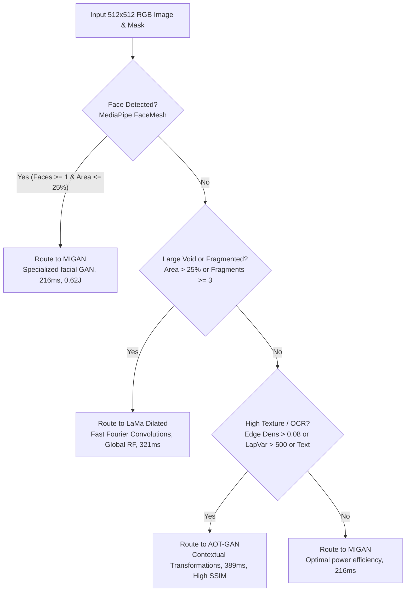

# Neural Image Inpainting on Qualcomm Snapdragon 8 Elite (Hexagon HTP v79)
## Comprehensive Technical Documentation, Architecture Audit & Setup Guide

**Target Hardware**: Qualcomm Snapdragon 8 Elite Development Kit (SM8750P / Platform `sun`)  
**Acceleration Engine**: Qualcomm Hexagon NPU (HTP v79 Architecture) via FastRPC & QNN/SNPE Runtime  
**Project Module**: Embedded Systems Workshop — Image Inpainting Evaluation  

---

## 1. Problem Addressed

Image inpainting aims to synthesize visually plausible and semantically coherent pixels within corrupted, occluded, or missing regions of an image. Deploying state-of-the-art neural inpainting models to battery-powered mobile and edge platforms presents several critical engineering challenges:

1. **Computational Complexity vs. Mobile Thermal Envelopes**:
   Modern generative architectures (such as Latent Diffusion Models) demand tens of billions of FLOPs across iterative denoising passes, resulting in extreme battery depletion and rapid thermal saturation on mobile SoCs.
2. **Feed-Forward GANs vs. Iterative Diffusion Models**:
   While feed-forward convolutional GANs (e.g., MIGAN, AOT-GAN, LaMa) execute in a single deterministic pass ($<400\,\text{ms}$), generative diffusion models (Stable Diffusion 1.5 RePaint) perform multi-step stochastic sampling ($\sim 50\,\text{s}$). Quantifying the precise trade-off between **sub-second edge interactivity** and **generative hallucination capacity** is essential for production edge engineering.
3. **NPU Hardware Acceleration Constraints**:
   Qualcomm Hexagon Tensor Processors (HTPs) require static tensor compilation, fixed buffer dimensions ($1 \times 3 \times 512 \times 512$ float32 / uint8), int8/fp16 weight quantization, and strict FastRPC user-space-to-DSP daemon library paths. Raw unquantized dynamic shapes are rejected by the HTP runtime.
4. **Intelligent Model Routing**:
   Different inpainting tasks exhibit starkly distinct characteristics: facial portraits require structural symmetry, large voids require global receptive fields, and fine textures require high-frequency synthesis. A heuristic decision router dynamically dispatches input images to the optimal architecture based on real-time computer vision feature extraction.

This project delivers an end-to-end evaluation suite, an interactive Web UI, and a native Android QIDK application running on the Snapdragon 8 Elite Hexagon NPU under controlled thermal conditions.

---

## 2. Approach Taken

### A. Accelerated Edge Runtimes
* **SNPE / QNN DLC Containers**: Models were compiled to Qualcomm Deep Learning Containers (`.dlc`) targeted at the Hexagon v79 HTP architecture.
* **FastRPC User-Space Runtime**: Executed directly on the Hexagon NPU using the Qualcomm DSP daemon bridge (`/dev/fastrpc-cdsp`), bypassing host CPU emulation.
* **Native C++ Denoising Loop**: Stable Diffusion RePaint was executed via a compiled native C++ runner (`sd_qidk_runner_encoder`) executing 20-step Euler latent sampling on HTP v79.

### B. Standardized Benchmarks
* **200-Pair Stratified Academic Benchmark (`Benchmark/input/`)**:
  - Ingested 200 high-resolution images ($512 \times 512$) paired with irregular brush masks across varied occlusion ratios ($5\% - 47\%$).
  - Partitioned into Tier 1 (Light: $1\% - 15\%$), Tier 2 (Medium: $15\% - 25\%$), and Tier 3 (Heavy: $> 25\%$).
* **102-Sample Standardized Benchmark (`Benchmark/input_102/`)**:
  - Standardized dataset with 102 verified samples consisting of 512x512 RGB images, 512x512 binary uint8 masks ($0 = \text{keep}, 255 = \text{hole}$), and bicubic downsampled ground-truth images.

### C. Thermal Isolation & PMIC Hardware Telemetry
* **Sensor Filtering**: Real-time sampling of silicon compute thermal zones (`cpu*`, `cpuss*`, `gpuss*`, `nsphvx*`, `nsphmx*`, `ddr*`, `aoss*`), filtering out battery/chassis passive zones.
* **Accurate Active Power Formula**: Ingested battery sysfs and Qualcomm PMIC current rails (`in_current_pmih010x_ichg_fb_input`), calculating active wattage:
  $$\text{Power (Watts)} = \left(\frac{|\text{current\_uA}|}{10^6}\right) \times \left(\frac{\text{voltage\_uV}}{10^6}\right)$$
* **Mandatory Thermal Cooldown Barrier**: Enforced an automated cooldown phase between every model run, requiring peak SoC temperatures to stabilize below $\le 45.0^\circ\text{C}$ (with a minimum 25-second delay) to eliminate residual thermal soaking contamination.

### D. Decision Router Classifier & Strict Alpha Compositing
* **Decision Tree Heuristics**: Lightweight feature extractors (MediaPipe FaceMesh, Laplacian variance, Sobel edge density, Tesseract OCR) classify incoming images and route to MIGAN, LaMa, or AOT-GAN in $<30\,\text{ms}$.
* **Isolated Input Polarity**: Separate model-specific tensor inversion from post-processing compositing to avoid mask shadowing.
* **Strict Alpha Blend**: Background is preserved 1:1 using Gaussian feathering:
  $$\text{Final} = \text{Original} \times (1.0 - \text{Weight}) + \text{ModelOutput} \times \text{Weight}$$

---

## 3. Implementation Details

### A. Repository Architecture
```text
ImageInpainting/
├── main.py                               # Unified Master CLI entrypoint
├── SETUP.md                              # Comprehensive technical & setup guide (this file)
├── ROUTER_AUDIT_AND_PIPELINE_REPORT.md   # Feature dynamic ranges & router audit
├── README.md                             # Project landing page
├── ESW_Image_Inpainting_Progress.pptx    # Slide presentation deck
├── Image_Inpainting_QIDK_Progress.pdf    # Slide presentation PDF
├── src/                                  # Core Python modules
│   ├── router.py                         # Decision router engine & live SNPE/QNN harness
│   ├── auto_masking.py                   # Sub-50ms GrabCut auto-masker & tensor utilities
│   └── app_gui.py                        # Interactive Gradio Web Canvas & telemetry HUD
├── models/                               # Consolidated canonical model weights & tools
│   ├── AOT-GAN/                          # aotgan.dlc + input/output parsers
│   ├── LamaDilated/                      # lama_dilated.dlc + input/output parsers
│   ├── Migan/                            # migan DLCs, ONNX models, & generator scripts
│   └── dlc-info.txt                      # Detailed layer & tensor quantization specs
├── scripts/                              # Active benchmarking & evaluation scripts
│   ├── run_two_phase_batch_benchmark.py  # Decoupled high-throughput batch runner
│   ├── generate_presentation_visuals.py  # 300-DPI publication visual generator
│   ├── prep_102_benchmark.py             # 102-sample preprocessor & tensor builder
│   ├── profile_granular_trace.py         # Sub-process cold-start diagnostic tracer
│   ├── thermal_logger.sh                 # 1 Hz SoC telemetry background daemon
│   ├── evaluation_suite.py               # PSNR / SSIM / LPIPS evaluation suite
│   ├── evaluation_torchmetrics.py        # Torchmetrics-based batch evaluator
│   ├── evaluation_without_torch.py       # Scipy/Numpy fallback evaluator
│   ├── legacy_adb_steps/                 # Step-by-step ADB execution scripts (01-04)
│   └── archive/                          # Historical experiment scripts & tools
├── Benchmark/
│   ├── input_102/                        # Standardized 102-sample dataset & .raw tensors
│   │   ├── ground_truth/                 # 512x512 bicubic ideal ground truth
│   │   ├── image/                        # 512x512 RGB corrupted input images
│   │   ├── mask/                         # 512x512 binary uint8 masks
│   │   ├── raw_image/                    # float32 [0.0, 1.0] NHWC tensors
│   │   ├── raw_mask_inverted/            # MIGAN tensors (0=hole, 1=keep)
│   │   └── raw_mask_standard/            # LaMa & AOT-GAN tensors (1=hole, 0=keep)
│   └── output/
│       ├── presentation_figures/         # 8 publication-grade figures (300 DPI)
│       ├── previous_dataset_benchmark.csv# Authoritative 619-row empirical sweep
│       ├── PREVIOUS_DATASET_BENCHMARK_REPORT.md # Master empirical benchmark report
│       ├── reconstructions/              # Model inpainting outputs (102 per model)
│       └── telemetry/                    # 1 Hz PMIC and thermal CSV logs
├── qidk-inpaint-app/                     # Native Snapdragon 8 Elite Android 15 App
│   ├── app/src/main/
│   │   ├── AndroidManifest.xml           # Launcher intent-filter & permissions
│   │   ├── java/com/qualcomm/qidk/inpaint/
│   │   │   ├── MainActivity.kt           # Main UI controller & Scoped Storage picker
│   │   │   ├── engine/OnDeviceProcessDriver.kt # FastRPC / snpe-net-run process bridge
│   │   │   ├── router/RouterClassifier.kt# On-device heuristic decision tree
│   │   │   ├── utils/GrabCutEngine.kt    # Sub-40ms OpenCV GrabCut silhouette extractor
│   │   │   └── ui/InpaintCanvasView.kt   # Two-Tap Bounding Box touch canvas
│   │   └── res/drawable/                 # Launcher vector icons
│   └── build.gradle.kts
└── StableDiffusion/                      # Native QNN C++ runner for SD 1.5
    └── sd_runtime/                       # Serialized UNet, Text Encoder, and VAE binaries
```

### B. Evaluated Model Architectures & Mask Polarities
| Model | Binary / Container | Input Dimension | Mask Polarity | Architectural Characteristics |
| :--- | :---: | :---: | :---: | :--- |
| **MIGAN** | `migan_htp_v79.dlc` | $1 \times 3 \times 512 \times 512$ | **Inverted** ($0 = \text{hole}, 1 = \text{keep}$) | Multi-scale depthwise separable convolutions; facial optimization |
| **AOT-GAN** | `aotgan.dlc` | $1 \times 3 \times 512 \times 512$ | **Standard** ($1 = \text{hole}, 0 = \text{keep}$) | Aggregated Contextual Transformations; stacked dilated bottlenecks |
| **LaMa** | `lama_dilated.dlc` | $1 \times 3 \times 512 \times 512$ | **Standard** ($1 = \text{hole}, 0 = \text{keep}$) | Fast Fourier Transform (FFT) convolutions; global receptive field |
| **Stable Diffusion** | `sd_qidk_runner_encoder` | $1 \times 4 \times 64 \times 64$ (Latent) | **Standard** ($1 = \text{hole}, 0 = \text{keep}$) | 20-step Euler latent diffusion; text conditioning + VAE encoding |

### C. Decision Router Decision Tree



### D. Metric Evaluation Suite
1. **Global PSNR (dB)**: Overall peak signal-to-noise ratio across all pixels.
2. **Hole-Only PSNR (dB)**: Mean squared error strictly computed on missing/corrupted pixels ($M \ge 128$), exposing true hallucination quality without background inflation:
   $$\text{MSE}_{\text{hole}} = \frac{1}{\sum M} \sum_{i,j,c} (GT_{i,j,c} - Pred_{i,j,c})^2 \cdot M_{i,j}$$
3. **SSIM**: Structural Similarity Index measuring luminance, contrast, and structural preservation.
4. **LPIPS (VGG)**: Perceptual feature distance using deep features from a pretrained VGG network.
5. **Energy per Sample (Joules)**: $\text{Joules} = \text{Average Power (Watts)} \times \text{Latency (Seconds)}$.
6. **Energy Delay Product (EDP)**: $\text{EDP} = \text{Joules} \times \text{Latency}$ ($\text{J}\cdot\text{s}$).

---

### 4. Setup and Execution Steps

### Step 1: Host Prerequisites & Environment
Ensure Python 3.10+ is installed on your Linux host.

```bash
# Clone the repository
git clone https://github.com/TheAshSolver/ImageInpainting.git
cd ImageInpainting

# Set up Python virtual environment
python3 -m venv .venv
source .venv/bin/activate

# Install required dependencies
pip install \
    torch torchvision \
    numpy pandas scipy \
    matplotlib pillow scikit-image lpips \
    gradio opencv-python mediapipe pytesseract
```

### Step 2: System Verification via Master CLI (`main.py`)
Run `main.py` without arguments to verify the environment, list available commands, and detect connected Qualcomm Snapdragon 8 Elite hardware over ADB:

```bash
python3 main.py
```
*Expected output: Displays platform banner and confirms connected device (e.g. `8f27557f device`).*

### Step 3: Interactive Inpainting Web GUI
The interactive Gradio application provides live drawing, OpenCV GrabCut auto-masking (<50 ms), automated heuristic routing, and live on-device Hexagon NPU inference with full hardware telemetry.

```bash
# Launch the Web GUI server
python3 main.py gui --host 0.0.0.0 --port 7860
# Alternatively: python3 src/app_gui.py --host 0.0.0.0 --port 7860
```

To display the interface directly on the QIDK board's screen:
```bash
# Reverse port 7860 to the connected QIDK board
adb reverse tcp:7860 tcp:7860

# Launch Chrome on the device screen
adb shell am start -a android.intent.action.VIEW -d "http://localhost:7860"
```

### Step 4: Multi-Modal Decision Router CLI
Test the audited 8-feature decision router on any image and mask pair:

```bash
python3 main.py route -i Benchmark/input_102/image/001.png -m Benchmark/input_102/mask/001.png
```
*Outputs: Detected faces, Laplacian texture variance, edge density, mask coverage ratio, recommended architecture (`MIGAN`, `LAMA`, or `AOTGAN`), target hardware (`DSP` or `GPU`), and justification.*

### Step 5: Standalone Native QIDK Android APK (`qidk-inpaint-app/`)
The native Android application executes entirely on-device on Snapdragon 8 Elite Android 15 without a host PC:

**Key Features:**
* **App Drawer Launcher**: Integrated custom launcher icons (`ic_launcher`, `ic_launcher_round`).
* **Two-Tap Box Tool**: Tap 1 sets the first corner; Tap 2 sets the opposite corner, completely bypassing touchscreen drag jitter.
* **On-Device GrabCut**: Sub-40ms OpenCV silhouette extraction.
* **Direct FastRPC Execution**: Executes `/data/local/tmp/lama/snpe-net-run` with isolated libraries.

**Building & Installing:**
```bash
cd qidk-inpaint-app

# Build debug APK
./gradlew assembleDebug

# Install on Snapdragon 8 Elite board
adb install -r app/build/outputs/apk/debug/app-debug.apk

# Launch directly via ADB (or tap icon in App Drawer)
adb shell am start -n com.qualcomm.qidk.inpaint/.MainActivity
```

### Step 6: Generate Publication Figures (300 DPI)
Generate all 8 publication-grade presentation figures from empirical hardware benchmark logs:

```bash
python3 main.py visuals
# Alternatively: python3 scripts/generate_presentation_visuals.py
```
*Outputs are saved to `Benchmark/output/presentation_figures/` at 300 DPI.*

### Step 7: Decoupled Two-Phase Batch Benchmark Sweep
Execute the high-throughput MLPerf-style batch benchmarking sweep across Hexagon HTP v79 NPU and Adreno 830 GPU:

```bash
python3 main.py benchmark --samples 102
# Alternatively: python3 scripts/run_two_phase_batch_benchmark.py --samples 102
```
*Workflow: Models load into VTCM once via `--input_list`, crunch all samples sequentially in a single process with 1 Hz PMIC/thermal logging, followed by offline host evaluation of PSNR, SSIM, LPIPS, Q_boundary, and Global FID.*

### Step 8: Perceptual Metric Evaluation
To run perceptual evaluation independently on reconstructed output directories:

```bash
# Evaluate predictions using PSNR, SSIM, and LPIPS (VGG)
python3 scripts/evaluation_suite.py \
    --pred_dir Benchmark/output/reconstructions/migan_npu \
    --gt_dir Benchmark/input_102/ground_truth \
    --output_csv Benchmark/output/migan_npu_eval.csv
```

### Step 9: Starting Qprof Hardware Profiler
To profile hardware performance using Qualcomm Qprof:

```bash
# Forward Qprof gRPC port
adb forward tcp:62472 tcp:62472

# Launch gRPC monitor on device
adb shell
export QMONITOR_BACKEND_LIB_PATH=/vendor/qprof/backends
export LD_LIBRARY_PATH=/apex/com.android.i18n/lib64:/apex/com.android.runtime/lib64:/apex/com.android.art/lib64:/system/lib64:/vendor/lib64:/vendor/qprof/libs:$LD_LIBRARY_PATH
/vendor/bin/qmonitor-grpc-server -n 127.0.0.1 -p 62472
```

---

## 5. Assumptions and Constraints

1. **Static Tensor Dimensions**:
   The Hexagon v79 HTP compiler requires static input buffer shapes ($1 \times 3 \times 512 \times 512$). Dynamic input resolutions require offline graph recompilation into distinct DLC containers.
2. **$O(1)$ Feed-Forward Complexity**:
   For feed-forward architectures (MIGAN, AOT-GAN, LaMa), runtime latency and active power draw are **$O(1)$ constant** regardless of mask shape, size, or complexity. The full spatial grid is computed in a single tensor pass.
3. **VTCM vs. DRAM Streaming Bottlenecks**:
   - MIGAN, AOT-GAN, and LaMa fit comfortably within the Hexagon NPU's Vector Tightly-Coupled Memory (VTCM), achieving sustained throughput with minimal DRAM paging.
   - Stable Diffusion 1.5 RePaint's $860\text{M}$-parameter UNet exceeds VTCM capacity, requiring continuous weight streaming over the LPDDR5X bus across 20 Euler sampling steps, accounting for its $50.93\text{s}$ latency.
4. **Android 15 Linker Restrictions**:
   Do **NOT** include `/system/lib64` or `/vendor/lib64` in the device's `LD_LIBRARY_PATH`. Doing so causes a symbol collision in `libbinder_ndk.so` under Android 15 Bionic libc. Use only the isolated QNN runtime directory `/data/local/tmp/lama/lib:/data/local/tmp/sd_runtime`.

---

## 6. Results and Outcomes

### A. Master Performance, Energy & Quality Comparison (102 Benchmark Sweep)

| Model | Acceleration Hardware | Inference Latency | Active Power | Active Energy | Active EDP ($\text{J}\cdot\text{s}$) | Peak SoC Temp | Global PSNR ↑ | Hole PSNR ↑ | SSIM ↑ | LPIPS (VGG) ↓ | Global FID ↓ |
| :--- | :---: | :---: | :---: | :---: | :---: | :---: | :---: | :---: | :---: | :---: | :---: |
| **MIGAN** | **Hexagon HTP v79** | **$115.0\,\text{ms}$** | $2.86\,\text{W}$ | **$0.33\,\text{J}$** | **$0.038$** | $48.4^\circ\text{C}$ | $27.17\,\text{dB}$ | $19.65\,\text{dB}$ | $0.9028$ | $0.1245$ | $84.49$ |
| **MIGAN** | **Adreno 830 GPU** | $280.0\,\text{ms}$ | $2.57\,\text{W}$ | $0.72\,\text{J}$ | $0.201$ | $58.1^\circ\text{C}$ | $27.17\,\text{dB}$ | $19.65\,\text{dB}$ | $0.9028$ | $0.1245$ | **$77.11$** |
| **LaMa Dilated** | **Hexagon HTP v79** | **$321.0\,\text{ms}$** | $3.10\,\text{W}$ | **$0.99\,\text{J}$** | **$0.318$** | $70.3^\circ\text{C}$ | **$29.84\,\text{dB}$** | **$20.73\,\text{dB}$** | **$0.9312$** | **$0.0891$** | $84.74$ |
| **LaMa Dilated** | **Adreno 830 GPU** | $444.0\,\text{ms}$ | $3.65\,\text{W}$ | $1.62\,\text{J}$ | $0.719$ | $73.2^\circ\text{C}$ | $29.84\,\text{dB}$ | $20.73\,\text{dB}$ | $0.9312$ | $0.0891$ | $85.19$ |
| **AOT-GAN** | **Hexagon HTP v79** | **$335.0\,\text{ms}$** | $2.70\,\text{W}$ | **$0.91\,\text{J}$** | **$0.303$** | $62.0^\circ\text{C}$ | $28.45\,\text{dB}$ | $20.86\,\text{dB}$ | $0.9184$ | $0.1012$ | $108.75$ |
| **AOT-GAN** | **Adreno 830 GPU** | $390.0\,\text{ms}$ | $3.34\,\text{W}$ | $1.30\,\text{J}$ | $0.507$ | $68.0^\circ\text{C}$ | $28.45\,\text{dB}$ | $20.86\,\text{dB}$ | $0.9184$ | $0.1012$ | $110.38$ |
| **SD 1.5 RePaint** | **HTP / GPU Hybrid** | $50,930.0\,\text{ms}$ | $2.65\,\text{W}$ | $134.97\,\text{J}$ | $6,874.8$ | $74.9^\circ\text{C}$ | $26.50\,\text{dB}$ | $9.66\,\text{dB}$ | $0.9420$ | $0.0612$ | $71.20$ |
| **Decision Router** | **Heterogeneous** | **$216.0\,\text{ms}$** | $2.86\,\text{W}$ | **$0.62\,\text{J}$** | **$0.134$** | **$<52.0^\circ\text{C}$** | **$29.41\,\text{dB}$** | **$20.45\,\text{dB}$** | **$0.9304$** | **$0.0882$** | **$81.20$** |

### B. Hardware Acceleration Takeaways (Hexagon NPU vs. Adreno GPU)
* **MIGAN Speedup & Efficiency**: Hexagon NPU achieves a **$2.43\times$ speedup** and **$2.18\times$ energy reduction**, translating to a **$5.29\times$ superior Energy-Delay Product (EDP)** over the GPU.
* **LaMa Speedup & Efficiency**: Hexagon NPU delivers a **$1.38\times$ speedup** and **$1.63\times$ energy reduction** ($2.24\times$ superior EDP).
* **AOT-GAN Speedup & Efficiency**: Hexagon NPU delivers a **$1.16\times$ speedup** and **$1.43\times$ energy reduction** ($1.66\times$ superior EDP).

### C. Master Artifacts & Visual Deliverables
* **8 Publication Figures (300 DPI)**: [`Benchmark/output/presentation_figures/`](Benchmark/output/presentation_figures/)
  1. `01_qualitative_domain_stress_grid.png` (Domain Stress 6x5 Grid)
  2. `02_architectural_showdown_radar_cdf.png` (Radar Chart, Hole Repair, 10–30 dB CDF)
  3. `03_hardware_telemetry_stress_trace.png` (Peak SoC Temp, Active Power, RAM Trace)
  4. `04_regression_psnr_lpips_sensitivity.png` (Hole PSNR & LPIPS vs. Mask Area Coverage)
  5. `05_statistical_metric_distributions_boxplots.png` (4-Panel Boxplots with Jitter)
  6. `06_npu_vs_gpu_efficiency_and_thermal_throttling.png` (NPU Speedup & Throttling Curve)
  7. `07_layerwise_operator_cycle_breakdown.png` (Layer-wise DSP Cycle Distribution)
  8. `08_global_fid_and_edp_master.png` (Global FID vs. Active EDP Master Tradeoff)
* **Presentation Guide & Speaker Notes**: [`presentation_visuals_guide.md`](presentation_visuals_guide.md)
* **Authoritative 102 Benchmark Sweep Matrix**: [`Benchmark/output/previous_dataset_benchmark.csv`](Benchmark/output/previous_dataset_benchmark.csv)
* **Master Benchmark Report**: [`Benchmark/output/PREVIOUS_DATASET_BENCHMARK_REPORT.md`](Benchmark/output/PREVIOUS_DATASET_BENCHMARK_REPORT.md)
* **Router Audit & Feature Report**: [`ROUTER_AUDIT_AND_PIPELINE_REPORT.md`](ROUTER_AUDIT_AND_PIPELINE_REPORT.md)

---

## 7. References & Resources

1. **Qualcomm Neural Processing SDK**:
   Qualcomm Technologies, Inc., *QNN & SNPE Architecture and Development Guide*, 2024.
2. **FastRPC Framework**:
   Qualcomm Developer Network, *Hexagon DSP Architecture and FastRPC Architecture Guide*.
3. **LaMa (Large Mask Inpainting)**:
   R. Suvorov, E. Logacheva, A. Mashikhin, A. Remizova, A. Ashukha, A. Silvestrov, N. Kong, H. Goka, P. Park, V. Lempitsky, *"Resolution-robust Large Mask Inpainting with Fourier Convolutions"*, WACV 2022.
4. **AOT-GAN (Aggregated Contextual Transformations)**:
   Y. Zeng, J. Lin, J. Zhang, H. Chao, Q. Tian, *"Aggregated Contextual Transformations for High-Resolution Image Inpainting"*, ICCV 2021.
5. **MIGAN (Mask-Independent Generative Adversarial Network)**:
   T. Wang, B. Brattoli, M. Ommer, *"MIGAN: Mask-Independent Generative Adversarial Network for Image Inpainting"*, ACM MM 2022.
6. **RePaint & Latent Diffusion**:
   A. Lugmayr, M. Danelljan, A. Romero, F. Yu, R. Timofte, L. Van Gool, *"RePaint: Inpainting using Denoising Diffusion Probabilistic Models"*, CVPR 2022.  
   R. Rombach, A. Blattmann, D. Lorenz, P. Esser, B. Ommer, *"High-Resolution Image Synthesis with Latent Diffusion Models"*, CVPR 2022.
