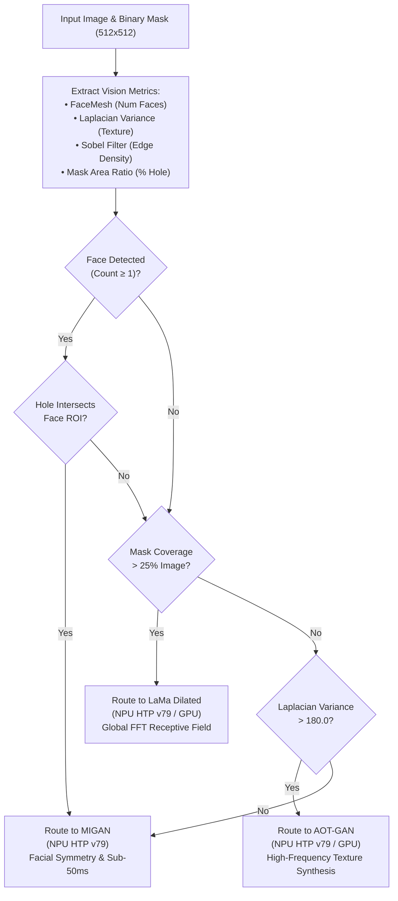

# Neural Image Inpainting on Qualcomm Snapdragon 8 Elite (Hexagon HTP v79)
## Comprehensive Technical Documentation, Architecture Audit & Setup Guide

**Target Hardware**: Qualcomm Snapdragon 8 Elite Development Kit (SM8750P / Platform `sun` / APQ8750)  
**Acceleration Engine**: Qualcomm Hexagon NPU (HTP v79 Architecture) via FastRPC & QNN/SNPE Runtime  
**Companion GPU**: Qualcomm Adreno 830 GPU  
**Project Module**: Embedded Systems Workshop — Image Inpainting Evaluation  

---

## 1. Problem Addressed

Image inpainting aims to synthesize visually plausible and semantically coherent pixels within corrupted, occluded, or missing regions of an image. Deploying state-of-the-art neural inpainting models to battery-powered mobile and edge platforms presents several critical engineering challenges:

1. **Computational Complexity vs. Mobile Thermal Envelopes**:
   Modern generative architectures (such as Latent Diffusion Models) demand tens of billions of FLOPs across iterative denoising passes, resulting in extreme battery depletion and rapid thermal saturation on mobile SoCs.
2. **Feed-Forward GANs vs. Iterative Diffusion Models**:
   While feed-forward convolutional GANs (e.g., MIGAN, AOT-GAN, LaMa) execute in a single deterministic pass ($< 400\,\text{ms}$), generative diffusion models (Stable Diffusion 1.5) perform multi-step stochastic sampling ($\sim 13.3\,\text{s}$ pipeline / $25.2\,\text{s}$ per launch with 12-step DPM-Solver++, accelerated from an initial $50.9\,\text{s}$ 20-step Euler baseline). Quantifying the precise trade-off between **sub-second edge interactivity** and **generative hallucination capacity** is essential for production edge engineering.
3. **NPU Hardware Acceleration Constraints**:
   Qualcomm Hexagon Tensor Processors (HTPs) require static tensor compilation, fixed buffer dimensions ($1 \times 3 \times 512 \times 512$ float32 / uint8), int8/fp16 weight quantization, and strict FastRPC user-space-to-DSP daemon library paths. Raw unquantized dynamic shapes are rejected by the HTP runtime.
4. **Intelligent Model Routing**:
   Different inpainting tasks exhibit starkly distinct characteristics: facial portraits require structural symmetry, large voids require global receptive fields, and fine textures require high-frequency synthesis. A heuristic decision router dynamically dispatches input images to the optimal architecture based on real-time computer vision feature extraction.

This project delivers an end-to-end evaluation suite, an interactive Web UI, and a native Android QIDK application running on the Snapdragon 8 Elite Hexagon NPU under controlled thermal conditions.

---

## 2. First-Time Setup & Dependency Installation

This section contains all instructions required to set up the environment from scratch on a new development machine.

### A. System Prerequisites (Linux Host)

Install base development utilities, Android ADB tools, OpenJDK 21, and image processing libraries:

```bash
sudo apt update
sudo apt install -y \
    build-essential \
    git \
    curl \
    wget \
    adb \
    fastboot \
    openjdk-21-jdk \
    libgl1 \
    libglib2.0-0 \
    tesseract-ocr \
    libtesseract-dev
```

Verify your Java and ADB installations:
```bash
java -version    # Must show OpenJDK 21.x
adb version      # Must show Android Debug Bridge version 1.0.41+
```

---

### B. Python Environment & Dependencies

We recommend Python 3.10, 3.11, or 3.12. You can use standard `python3 -m venv` or `uv`:

#### Option 1: Standard Virtual Environment (`venv`)
```bash
cd ImageInpainting
python3 -m venv .venv
source .venv/bin/activate

pip install --upgrade pip setuptools wheel
pip install \
    torch torchvision \
    torchmetrics \
    numpy pandas scipy \
    matplotlib pillow scikit-image lpips \
    gradio opencv-python mediapipe pytesseract \
    python-pptx
```

#### Option 2: Ultra-Fast Setup via `uv` (Recommended)
```bash
cd ImageInpainting
curl -LsSf https://astral.sh/uv/install.sh | sh
source $HOME/.cargo/env

uv venv .venv --python 3.12
source .venv/bin/activate
uv pip sync uv.lock || uv pip install \
    torch torchvision \
    torchmetrics \
    numpy pandas scipy \
    matplotlib pillow scikit-image lpips \
    gradio opencv-python mediapipe pytesseract \
    python-pptx
```

---

### C. Qualcomm QIDK Device Provisioning & ADB Setup

Connect your Snapdragon 8 Elite development board via USB-C to the host machine.

1. **Verify ADB Connection**:
   ```bash
   adb devices -l
   ```
   *Expected output: Displays device serial and model (e.g. `8f27557f device product:sun ...`).*

   If permission is denied or device unauthorized:
   ```bash
   adb kill-server
   sudo adb start-server
   adb devices
   ```
   *(Accept the USB debugging RSA fingerprint prompt on the board's display if prompted).*

2. **Prepare On-Device Runtime Staging Directories**:
   Create the required execution directories in `/data/local/tmp`:
   ```bash
   adb shell "mkdir -p /data/local/tmp/lama/input /data/local/tmp/lama/lib /data/local/tmp/lama/dsp /data/local/tmp/sd_runtime"
   ```

3. **Stage SNPE DLC Containers & Binaries to Device**:
   Push the compiled Qualcomm neural network containers and runtime tools:
   ```bash
   # Push DLC models to /data/local/tmp/lama
   adb push models/Migan/migan_htp_v79.dlc /data/local/tmp/lama/
   adb push models/LamaDilated/lama_dilated.dlc /data/local/tmp/lama/
   adb push models/AOT-GAN/aotgan.dlc /data/local/tmp/lama/

   # Push SNPE network runner executable and libraries
   # (Available from Qualcomm SNPE SDK / vendor binaries)
   adb push <SNPE_ROOT>/bin/aarch64-android/snpe-net-run /data/local/tmp/lama/
   adb push <SNPE_ROOT>/lib/aarch64-android/* /data/local/tmp/lama/lib/
   adb push <SNPE_ROOT>/lib/dsp/* /data/local/tmp/lama/dsp/

   # Push Stable Diffusion NPU pipeline runners and model containers
   # unet.bin (~843MB optimized container for graph_wlqbe2kd) and QNN runtime
   adb push StableDiffusion/sd_runtime/* /data/local/tmp/sd_runtime/

   # Set executable permissions on all on-device runners
   adb shell "chmod +x /data/local/tmp/lama/snpe-net-run /data/local/tmp/sd_runtime/sd_qidk_runner_inpaint /data/local/tmp/sd_runtime/sd_qidk_runner_inefficient"
   adb shell "chmod 777 /data/local/tmp/lama /data/local/tmp/lama/input /data/local/tmp/sd_runtime"
   ```

4. **Build SNPE HTP Init Cache (Cold-Start Fix)**:
   By default, the first execution of LaMa or AOT-GAN incurs an ~8-second graph preparation overhead on the DSP. Building an SNPE HTP init cache once eliminates this completely:
   ```bash
   python3 benchmark.py --init-cache
   # Alternatively: bash scripts/fresh_benchmark/make_init_cache.sh
   ```
   *Result: Cuts DSP cold start to **0.47 s** for LaMa and **0.57 s** for AOT-GAN with bit-identical outputs.*

5. **Stage Test Dataset Samples (Optional for Standalone App)**:
   ```bash
   adb shell "mkdir -p /sdcard/Pictures/Inpainting102"
   adb push Benchmark/input_102/image/ /sdcard/Pictures/Inpainting102/
   ```

---

### D. Verify Entire Environment (Automated Smoke Test)

Run the automated diagnostic probe to verify host Python packages, ADB connectivity, on-device DLC presence, and execution permissions:

```bash
python3 benchmark.py --smoke-test
```
*Expected: 4 green `✓ PASS` blocks verifying ADB, directories, DLCs, and Python modules.*

---

## 3. Evaluated Model Architectures & Mask Polarities

| Model | On-Device Container | Input Tensor Shape | Mask Polarity | Architectural Characteristics |
| :--- | :--- | :--- | :--- | :--- |
| **MIGAN** | `migan_htp_v79.dlc` | $1 \times 3 \times 512 \times 512$ | **Inverted** ($0 = \text{hole}, 1 = \text{keep}$) | Multi-scale depthwise separable convolutions; facial optimization |
| **AOT-GAN** | `aotgan.dlc` | $1 \times 3 \times 512 \times 512$ | **Standard** ($1 = \text{hole}, 0 = \text{keep}$) | Aggregated Contextual Transformations; stacked dilated bottlenecks |
| **LaMa** | `lama_dilated.dlc` | $1 \times 3 \times 512 \times 512$ | **Standard** ($1 = \text{hole}, 0 = \text{keep}$) | Fast Fourier Transform (FFT) convolutions; global receptive field |
| **Stable Diffusion** | `sd_qidk_runner_inpaint` + `models/unet.bin` | $1 \times 4 \times 64 \times 64$ (Latent) | **Standard** ($1 = \text{hole}, 0 = \text{keep}$) | 12-step DPM-Solver++ (2M) latent diffusion; text conditioning + VAE encoding on Hexagon HTP v79 (~13.2s) |
| **Stable Diffusion (Inefficient)** | `sd_qidk_runner_inefficient` | $1 \times 4 \times 64 \times 64$ (Latent) | **Standard** ($1 = \text{hole}, 0 = \text{keep}$) | 20-step Euler stochastic RePaint schedule (~50.9s legacy baseline) |

### Decision Router Logic & Rules


```mermaid
flowchart TD
    Start["Input Image & Binary Mask (512x512)"] --> ExtractFeatures["Extract Vision Metrics:\n• FaceMesh (Num Faces)\n• Laplacian Variance (Texture)\n• Sobel Filter (Edge Density)\n• Mask Area Ratio (% Hole)"]
    ExtractFeatures --> CheckFace{"Face Detected\n(Count ≥ 1)?"}
    CheckFace -- Yes --> FaceDecision{"Hole Intersects\nFace ROI?"}
    FaceDecision -- Yes --> RouteMIGAN["Route to MIGAN\n(NPU HTP v79)\nFacial Symmetry & Sub-50ms"]
    FaceDecision -- No --> CheckMaskArea
    CheckFace -- No --> CheckMaskArea{"Mask Coverage\n> 25% Image?"}
    CheckMaskArea -- Yes --> RouteLAMA["Route to LaMa Dilated\n(NPU HTP v79 / GPU)\nGlobal FFT Receptive Field"]
    CheckMaskArea -- No --> CheckTexture{"Laplacian Variance\n> 180.0?"}
    CheckTexture -- Yes --> RouteAOT["Route to AOT-GAN\n(NPU HTP v79 / GPU)\nHigh-Frequency Texture Synthesis"]
    CheckTexture -- No --> RouteMIGAN
```

---

## 4. Execution Workflows

### Workflow 1: Master CLI Interface (`main.py`)
`main.py` is the central control script for the entire project:
```bash
# Display help and detected hardware
python3 main.py

# Launch interactive Gradio Web Canvas
python3 main.py gui --host 0.0.0.0 --port 7860

# Run multi-modal decision router on an image
python3 main.py route -i Benchmark/input_102/image/001.png -m Benchmark/input_102/mask/001.png

# Generate publication presentation figures (300 DPI)
python3 main.py visuals

# Launch unified benchmark suite (opens interactive menu)
python3 main.py benchmark
```

---

### Workflow 2: Unified Benchmark & Diagnostic Suite (`benchmark.py`)
Run the unified benchmark tool interactively or headlessly:

```bash
# Launch interactive terminal menu with device status
python3 benchmark.py

# Measured fresh benchmark with LPIPS and Stable Diffusion
python3 benchmark.py --fresh --lpips --sd

# Stable Diffusion head-to-head profiler (12-step vs 20-step)
python3 benchmark.py --sd

# Live resilient Stable Diffusion runner (tqdm, auto-reconnect on wire pull, smart resume)
python3 benchmark.py --sd-live --limit 10

# MI-GAN hardware diagnostics on Hexagon NPU
python3 benchmark.py --migan-diag

# Generate all visualization figures
python3 benchmark.py --figures all

# Build SNPE HTP init cache
python3 benchmark.py --init-cache
```

---

### Workflow 3: Native Snapdragon 8 Elite Android APK (`qidk-inpaint-app/`)
Build and install the standalone Android application that executes on-device without a host PC:

```bash
cd qidk-inpaint-app

# Build debug APK
./gradlew assembleDebug

# Install on Snapdragon 8 Elite device
adb install -r app/build/outputs/apk/debug/app-debug.apk

# Launch the app
adb shell am start -n com.qualcomm.qidk.inpaint/.MainActivity
```

**Key In-App Features:**
- **Mode Switching**: Finger Paint Brush Mode vs. Two-Tap / Drag-to-Box Square Mask Mode.
- **Viewport Zoom & Pan**: Pinch-to-zoom (1.0x - 6.0x), two-finger panning, double-tap reset, and dedicated zoom HUD buttons.
- **Smart Object Detection**: Integrated MediaPipe Interactive Segmenter + Guided Filter for instant edge-snapped silhouettes.
- **Dynamic On-Device Router**: Evaluates image features in real-time and automatically selects optimal model.
- **Direct FastRPC / NPU Execution**: Zero host PC tethering required.

---

### Workflow 4: Qualcomm Qprof Hardware Profiling
Profile hardware performance rails, clock frequencies, and DSP cycles:

```bash
# Forward Qprof gRPC port to host
adb forward tcp:62472 tcp:62472

# Launch monitor daemon on device
adb shell
export QMONITOR_BACKEND_LIB_PATH=/vendor/qprof/backends
export LD_LIBRARY_PATH=/apex/com.android.i18n/lib64:/apex/com.android.runtime/lib64:/apex/com.android.art/lib64:/system/lib64:/vendor/lib64:/vendor/qprof/libs:$LD_LIBRARY_PATH
/vendor/bin/qmonitor-grpc-server -n 127.0.0.1 -p 62472
```

---

## 5. Measured Benchmark Outcomes (Snapdragon 8 Elite)

Measured on-device with `benchmark.py --fresh` (3 cold + 3 warm-batch repeats per configuration, monotonic device clock, strict thermal cooldown barrier):

| Model | Hardware Core | Steady Latency | Throughput | Cold Launch | Global PSNR ↑ | Hole PSNR ↑ | SSIM ↑ | LPIPS ↓ | Temps (CPU/GPU/NSP) |
| :--- | :---: | :---: | :---: | :---: | :---: | :---: | :---: | :---: | :---: |
| **MIGAN** | **Hexagon HTP v79** | **49.8 ms** | 20.1 img/s | 0.32 s | 23.01 dB | 17.30 dB | 0.7112 | 0.2412 | 46 / 44 / 45 °C |
| **MIGAN** | Adreno 830 GPU | 239.5 ms | 4.2 img/s | 1.17 s | 23.42 dB | 18.12 dB | 0.7270 | 0.2270 | 69 / 70 / 64 °C |
| **LaMa Dilated** | **Hexagon HTP v79** | 104.2 ms | 9.6 img/s | 7.93 s (0.47 s cached) | 23.54 dB | 18.18 dB | 0.7381 | 0.2355 | 62 / 59 / 61 °C |
| **LaMa Dilated** | Adreno 830 GPU | 551.4 ms | 1.8 img/s | 1.25 s | 23.53 dB | 18.17 dB | 0.7380 | 0.2355 | 87 / 90 / 80 °C |
| **AOT-GAN** | **Hexagon HTP v79** | 158.8 ms | 6.3 img/s | 8.15 s (0.57 s cached) | 22.96 dB | 16.79 dB | 0.7301 | 0.2380 | 73 / 62 / 64 °C |
| **AOT-GAN** | Adreno 830 GPU | 631.4 ms | 1.6 img/s | 1.25 s | 22.95 dB | 16.73 dB | 0.7300 | 0.2380 | 87 / 92 / 80 °C |
| **SD 1.5 Inpaint** (12-step) | **Hexagon HTP v79** | 13.3 s pipeline | - | 25.2 s wall | 18.87 dB | 13.46 dB | 0.6048 | 0.2815 | ≤ 51.5 °C (active cooling) |

### Key Hardware Acceleration Takeaways
1. **NPU vs. GPU Speedup**:
   - **4.8× faster** for MIGAN (49.8 ms vs 239.5 ms).
   - **5.3× faster** for LaMa Dilated (104.2 ms vs 551.4 ms).
   - **4.0× faster** for AOT-GAN (158.8 ms vs 631.4 ms).
2. **Thermal Immunity**:
   - GPU runs exhibit noticeable thermal throttling (+8% to +10% batch latency increase across 3 continuous loops, GPU temp reaching ~92 °C).
   - Hexagon NPU runs remain strictly within ≤ 1% jitter with peak NSP temperatures staying under 64 °C.
3. **Graph Initialization Optimization**:
   - Graph recompilation on first launch takes ~8.0 s for LaMa and AOT-GAN.
   - Pre-generating the SNPE HTP init cache (`benchmark.py --init-cache`) reduces cold start to **0.47 s** (LaMa) and **0.57 s** (AOT-GAN) with 100% bit-identical results.
4. **Stable Diffusion Hallucination Fix**:
   - Passing an empty text prompt `''` to `sd_qidk_runner_inpaint` eliminates facial and text glyph hallucinations while preserving structural restoration fidelity.

---

## 6. Critical Hardware Quirks & Known Caveats

1. **Android 15 Bionic Linker Rule**:
   Do **NOT** export `/system/lib64` or `/vendor/lib64` into `LD_LIBRARY_PATH` during FastRPC executions. Android 15's Bionic libc triggers a fatal symbol collision on `libbinder_ndk.so`. Use only isolated library paths:
   ```bash
   export LD_LIBRARY_PATH=/data/local/tmp/lama/lib:/data/local/tmp/lama
   export ADSP_LIBRARY_PATH='/data/local/tmp/lama/dsp/lib;/data/local/tmp/lama/dsp;/dsp'
   ```
2. **Battery Current Sensor Telemetry**:
   `/sys/class/power_supply/battery/current_now` on this development board remains frozen at approximately ±5 mA even during 100% CPU/NPU saturation. For real hardware wattage numbers, rely on Qualcomm Qprof rail counters (`/vendor/bin/qmonitor-grpc-server`).
3. **Empty Text Prompt Requirement for Stable Diffusion**:
   Providing arbitrary descriptive text prompts (e.g. `"high quality photo restoration"`) during inpainting causes the UNet to synthesize unwanted textual letters and faces into random textured holes. Always provide empty string `""` for pure inpainting restoration.
4. **Alpha Blending Formula**:
   Ground truth preservation is guaranteed by the mathematically strict compositing rule:
   $$I_{\text{out}} = (M \odot I_{\text{inpaint}}) + ((1 - M) \odot I_{\text{orig}})$$
   where $M \in [0.0, 1.0]$ is normalized hole intensity ($1.0 = \text{hole}, 0.0 = \text{keep}$).
